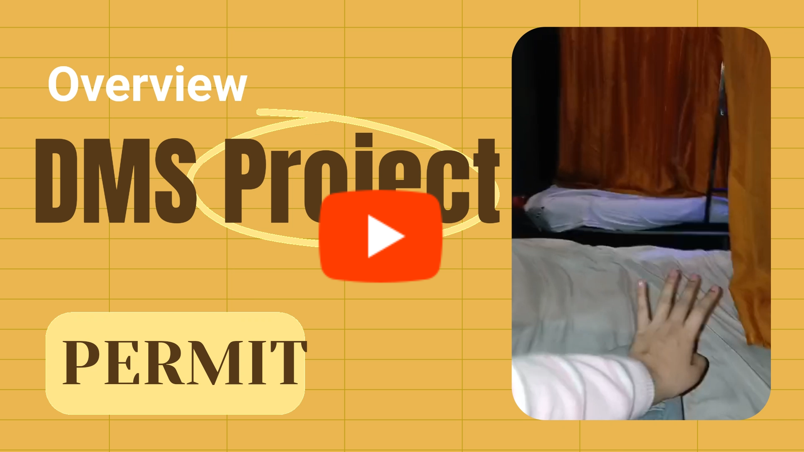

# Document Management System with Fine-Grained Authorization

This project demonstrates how to implement fine-grained authorization in a Next.js application using Permit.io. It's a document management system where users can create, view, edit, and delete documents based on their roles and document ownership.

## Features

- **Role-Based Access Control (RBAC)**: Different roles (Admin, Editor, Viewer) have different permissions
- **Attribute-Based Access Control (ABAC)**: Document owners have special privileges
- **Fine-Grained Authorization**: Using Permit.io to implement complex authorization rules
- **Next.js App Router**: Modern React application with server components and server actions
- **Responsive UI**: Using Tailwind CSS and shadcn/ui components

## Authorization Model

The application implements the following authorization model:

- **Admin**: Can create, view, edit, and delete any document, and access the admin panel
- **Editor**: Can create, view, and edit documents, but can only delete their own documents
- **Viewer**: Can only view documents

Additionally, document owners have full control over their own documents regardless of their role.

## Demo Video and Resources
[](https://youtu.be/zWEPYTF0AlQ)

If you're a reader, then this blog is for you: **https://dev.to/rohan_sharma/access-control-handled-heres-how-i-built-my-dms-212**

&nbsp;

## Getting Started

### Prerequisites

- Node.js 18+
- Permit.io account

### Installation

1. Clone the repository
2. Install dependencies:
   ```bash
   npm install
   ```
   or
   ```bash
    yarn install
    ```
    or
    ```bash
    bun install
    ```

3. Set up environment variables:
   ```
   PERMIT_PDP_URL=your-permit-pdp-url
   PERMIT_SDK_TOKEN=your-permit-sdk-token
   ```

### Running the Application

```bash
npm run dev
```

The application will be available at http://localhost:3000.

### Test Credentials

- Admin:
  - Username: admin
  - Password: 2025DEVChallenge
- Regular User:
  - Username: newuser
  - Password: 2025DEVChallenge
- View:
  - Username: viewer
  - Password: 2025DEVChallenge

## Setting Up Permit.io

### 1. Install the Permit CLI

```bash
npm install -g @permitio/permit-cli
```

### 2. Login to Permit.io

```bash
permit login
```

### 3. Initialize a New Project

```bash
permit init
```

### 4. Define Your Resources

```bash
permit resource create document
permit resource create admin_panel
```

### 5. Define Actions

```bash
permit action create create --resource document
permit action create read --resource document
permit action create update --resource document
permit action create delete --resource document
permit action create access --resource admin_panel
```

### 6. Define Roles

```bash
permit role create admin
permit role create editor
permit role create viewer
```

### 7. Define Permissions

```bash
# Admin permissions
permit permission create --role admin --action create --resource document
permit permission create --role admin --action read --resource document
permit permission create --role admin --action update --resource document
permit permission create --role admin --action delete --resource document
permit permission create --role admin --action access --resource admin_panel

# Editor permissions
permit permission create --role editor --action create --resource document
permit permission create --role editor --action read --resource document
permit permission create --role editor --action update --resource document

# Viewer permissions
permit permission create --role viewer --action read --resource document
```

### 8. Define Resource Attributes

```bash
permit resource-attribute create ownerId --resource document --type string
permit resource-attribute create isPublic --resource document --type boolean
```

### 9. Define Resource Relations

```bash
permit resource-relation create owner --resource document --relation-type single --subject-set user
```

### 10. Define Condition Sets

```bash
# Document owner can do anything with their document
permit condition-set create document-owner --resource document --conditions "resource.ownerId == user.key"

# Allow all actions for document owners
permit permission create --condition-set document-owner --action create --resource document
permit permission create --condition-set document-owner --action read --resource document
permit permission create --condition-set document-owner --action update --resource document
permit permission create --condition-set document-owner --action delete --resource document
```

## Implementation Details

### Permit.io Integration

The application integrates with Permit.io through the `permit.ts` file, which provides functions for checking permissions:

```typescript
import { Permit } from 'permitio'

// Initialize Permit SDK
const permit = new Permit({
  pdp: process.env.PERMIT_PDP_URL,
  token: process.env.PERMIT_SDK_TOKEN,
})

// Check if a user can perform an action on a resource
export async function checkPermission(
  userId: string,
  action: string,
  resourceType: string,
  resourceAttributes: Record<string, any> = {}
): Promise<boolean> {
  try {
    const permitted = await permit.check(userId, action, {
      type: resourceType,
      ...resourceAttributes,
    })
    return permitted
  } catch (error) {
    console.error('Permission check failed:', error)
    return false
  }
}
```

### Server-Side Authorization

Server actions use the Permit.io SDK to check permissions before performing operations:

```ts
export async function createDocument(data: { title: string; content: string; isPublic: boolean }, userId: string) {
  // Check if user has permission to create documents
  const hasPermission = await checkPermission(
    userId,
    ACTIONS.CREATE,
    RESOURCES.DOCUMENT
  )
  
  if (!hasPermission) {
    throw new Error('You do not have permission to create documents')
  }
  
  // Create document...
}
```

### Client-Side Authorization

The UI uses a simplified client-side permission check to determine what actions to show:

```ts
const canUpdateDocument = hasPermission(
  user.role,
  ACTIONS.UPDATE,
  RESOURCES.DOCUMENT,
  { id: document.id, ownerId: document.ownerId, userId: user.id }
)

// Only show edit button if user has permission
{canUpdateDocument && (
  <Button onClick={() => setIsEditing(true)}>
    Edit
  </Button>
)}
```

## Benefits of Externalized Authorization

1. **Separation of Concerns**: Authorization logic is separated from application code
2. **Centralized Policy Management**: All authorization rules are defined in one place
3. **Consistent Enforcement**: Authorization is enforced consistently across the application
4. **Reduced Complexity**: Complex authorization rules are handled by Permit.io
5. **Easier Maintenance**: Changes to authorization rules don't require code changes
6. **Audit Trail**: All authorization decisions can be logged and audited

## Conclusion

This project demonstrates how to implement fine-grained authorization in a Next.js application using Permit.io. By externalizing authorization, we can create more secure, maintainable, and flexible applications.

&nbsp;

## Setup and Contributing Guidelines
    
**Set Up Your Environment**

1. `Fork` our repository to your GitHub account. 
2. `Clone` your fork to your local machine. 
    Use the command `git clone https://github.com/RS-labhub/Document_Management_System.git`.
3. Create a new branch for your work. 
    Use a descriptive name, like `fix-login-bug` or `add-user-profile-page`.
    
**Commit Your Changes**

- Commit your changes with a _clear commit message_. 
  e.g `git commit -m "Fix login bug by updating auth logic"`.

**Submit a Pull Request**

- Push your branch and changes to your fork on GitHub.
- Create a pull request, compare branches and submit.
- Provide a detailed description of what changes you've made and why. 
  Link the pull request to the issue it resolves. 🔗
    
**Review and Merge**

- I will review your pull request and provide feedback or request changes if necessary. 
- Once your pull request is approved, we will merge it into the main codebase 🥳

$~$

## Meet the Author


### Contact 
- Email: rs4101976@gmail.com
- Head over to my github handle from [here](https://github.com/RS-labhub)

&nbsp;

<p align="center">
<a href="https://twitter.com/rrs00179" target="blank"></a>
<a href="https://www.linkedin.com/in/rohan-sharma-9386rs/" target="blank"></a>
</p>

&nbsp;

<p align="center">
   Thank you for visting this Repo <br>If you like it, <a href="https://github.com/RS-labhub/Document_Management_System/stargazers">star</a> ⭐ it
</p>
